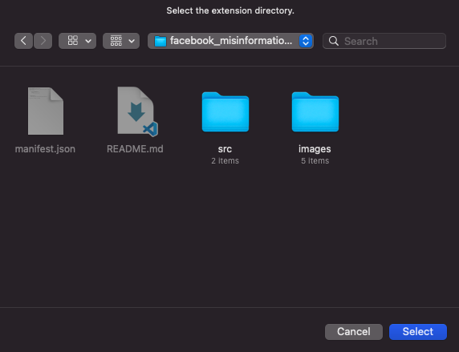
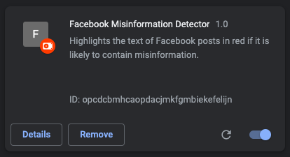

# Facebook Misinformation Detector

William Reames\
04/23/2023

## About this Repository

This repository contains the source code for a Chrome Extension that can detect misinformation within Facebook posts. If the extension detects any potential misinformation, the text will be highlighted in red. This can allow a user to be more aware of potential misinformation.

However, it should be noted that the extension is only making its ***best approximations*** for what could potentially be misinformation, and it ***may not be entirely accurate.***

The machine learning algorithm used by this extension was created by [Nishit Patel](https://github.com/nishitpatel01), a Data Scientist and Machine Learning professional at Google. The source code for the algorithm can be found here: https://github.com/nishitpatel01/Fake_News_Detection. 

## Installing the Extension

1. Download this repository

    `# git clone https://github.com/wdreames/facebook_misinformation_detector.git`

2. Open the Chrome Extensions developer console. Enter `chrome://extensions/` into a Chrome window. You should be able to see a page similar to this:

    

    Make sure the `Developer mode` button is switched on:

    

3. Click on `Load Unpacked`.

    

4. Select the directory where you downloaded this repository.

    

5. At this point, the extension should be successfully installed, and should be visible within the extensions panel:

    

## Using the Extension

If you were successfully able to install the extension, it should begin working automatically. Start scrolling through your Facebook feed to test it out! :)

## Advanced Use

### Finding the exact truth scores

When the extension checks a post for misinformation, it feeds the post's text into a machine learning algorithm that outputs a number from a range of 0 to 1. This value indicates how likely the text is to be true. If the value is ever below 0.5, the text of that post will be highlighted. 

If you are interested in learning the exact values that are determined for each post, you can open the Chrome developer console. The values will be displayed there under the "info" section.

### Changing the truth score threshold

The machine learning algorithm was configured to work based on a threshold of 0.5. However, if you would like to use a different value, you can change the `misinformationThreshold` constant in [src/content.js](src/content.js).

### Changing the machine learning algorithm

The machine learning algorithm is currently being called through the use of a GET request. If you are able to find or set up a different algorithm that you believe would work better than the current implementation, you can alter how this request is called by completing the following steps:

1. Change the `misinfoProcessorSeverURL` constant in [src/content.js](src/content.js).
2. Change the `misinfoProcessorParameterKey` constant in [src/content.js](src/content.js).
3. Add the new server URL to the [manifest.json](manifest.json) file under `"host_permissions"`.

This would still require that the algorithm can be called through a GET request and output a probability representing the likelihood that the inputted text is true.
